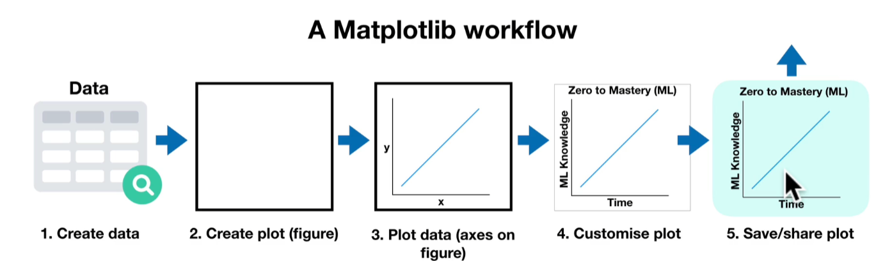
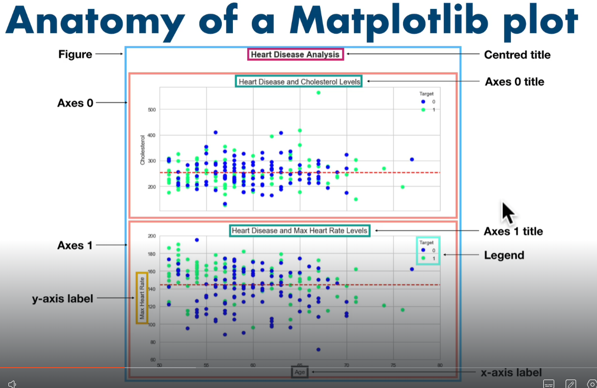

# Matplotlib Study notes
## What is Matplotlip
- Allow us to turn our data in to visulizations known as plots or figures
- Is a part of the Data Analysis phase of data science
- Can also be a part of the experiments phase
- Built on NumPy arrays and Python
- Written in Python
- Integrates directly with Pandas
- Can create basic of advanced plots
- Typical Matplotlib workflow:
    1. Create, collect data
    2. Create a plot (aka figure) which is kind of like an empty square, a canvas to get started
    3. Plot the data, put the axes on the figure. Axes and Figure are the two main data classes of Matplotlib
    4. Customise our plot. Add a title, add names to axes
    5. Save and share our plot.

## Anatomy of a Matplotlib Plot(Figure)
- Figure: The blank Canvas. Also know as a Plot
- Centered Title: Title at top of Canvas
- Axes: Can have multiple axes inside a figure. EG Axes 0, Axes 1. Can be thought of as a sub plot or sub figure. You can have multiple sub plots or axes.
- Axes Title: Each Axes, like axes 0 and axes 1 here, can have it's own title.
- y-axis label, x-axis lable: Each of our axes, like axes 0 and axes 1 here, can have there own axis label or they can even share a lable.
- Legend: Each axes can have a legend to give more information about the data.

