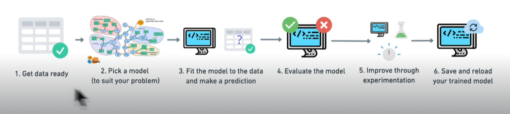

# Scikit-learn: Creating Machine Learning Models

- Scikit-learn is the standard machine learning library to use

## Introduction

- Often called sklearn
- Is a Python machine learning library
- Helps us build machine learning models from our data
- Helps find patterns in our data and from there make predictions
- Implements tools to evaluate those predictions
- Is built on NumPy and Matplotlib
- Has many built in machine learning models
- Has methods to evaluate our machine leaning models
- Scikit-Learn workflow:
  

1. Get data ready
2. Pick a model to suit your problem
3. Fit the model to our data ( or find patterns in our data) and make a prediction
4. Evaluate the model. Are our discovered predictions worth holding onto?
5. Improve throuh experimentation. Maybe they weren't useful predictions.
6. Save and reload your trained model. This would allow us to put it into and application or share it.

## What is Machine Learning

- With machine learning we can teach a computer what something is.
- Where in programming we take input and write a function to give us an output, ML does the opposite.
- Machine Learning takes the input and output and figures out the function or coding in between needed to get that result.
- EG: A input is 1000 images of animals and a corresponding B output of 1000 boolean results of whether the image is a snake or not. Then ML goes and figures out the mapping of A to B. It creates the function. It creates the 'model'. It finds the patterns that that make image 1 > True (is a snake) and image 2 > False (is not a snake). ML can then use those patterns to determine whether an image is a snake in another program.
- This machine leaning model can also be called an algorithm.
- To train this model we need to give it lots of data
- Machine Learning is a computer creating it's own model, it's own function, it's own code, based on the inputs and outputs

## Data Science - Clean, Transform, Reduce
- To make our data more useful we want to take these steps: 
  - Clean Data > Transform Data -> Reduce Data.
- Clean Data:
  - Remove and replace data. Eliminate missing values
  - Remove a row if it has missing value is one option
  - Or we could calculate average values for the missing fields
  - Remove outliers in our data
- Transform Data:
  - Computers don't understand concepts
  - So a computer can understand our data we need to convert it to something it understands
  - We need to convert everything to numbers, Even things like colors need to be come a number
- Reduce Data:
  - The more data we need to compute the more cpu power / energy / cost needed to run computations
  - If we can get the same result on less data and time then it will save us money and time
  - Sometimes called Dimensionality Reduction or Column Reduction
  - The more columns you have the slower computation will be. Maybe there are some irrelevant columns that can be removed.
  - 